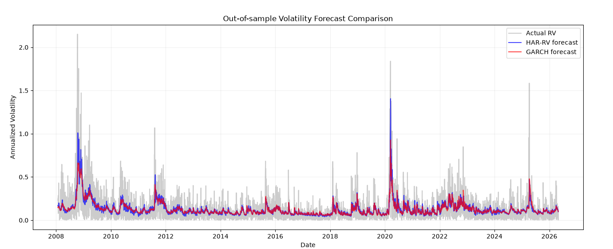
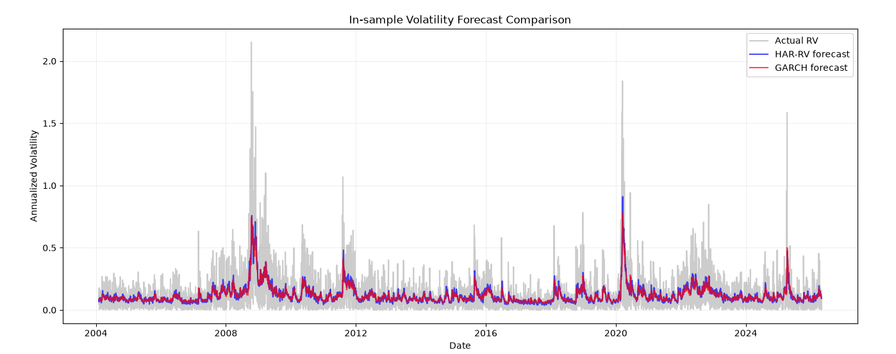

# Forecasting S&P 500 Realized Volatility: HAR-RV vs GARCH(1,1)

**Author:** Chunyang Tian
**Latest update:** July 2026
**Goal:** Compare two volatility forecasting models, HAR-RV (Corsi 2009) and GARCH(1,1) (Bollerslev 1986), to find out which model is better at predicting next-day realized volatility on S&P 500 data.

## Purpose & Outcome

This project want to answer one question: when we forecast tomorrow's market volatility, should we use the new approach (HAR-RV) or the classic approach (GARCH)?

Both models predict the same thing, tomorrow's volatility, but they use the data in very different ways. HAR-RV directly average the past volatility over 1, 5, and 21 days. GARCH instead use raw returns and update through a recursive formula. I run a strict out-of-sample test on SPY data from 2004 to 2026 to see which one give smaller error.

The main finding is that HAR-RV and GARCH are **statistically tied**. GARCH have a slightly lower out-of-sample MSE (2.5% lower), but a Diebold-Mariano test say this gap is not significant. What is not a tie: both models beat a random-walk baseline by about 46%. So both of them do extract real signal about tomorrow's volatility, and they extract about the same amount of it.

## Data and Features

- SPY daily close price from Yahoo Finance, 2004-01-01 to 2026-05-01 (5595 days)
- Daily log return: log(Close_today / Close_yesterday)
- Realized volatility (RV): abs(Return) × sqrt(252)
- This is a simple proxy. The "true" RV need intraday data (5-minute returns), which I don't have free access to. This is a known limitation, and it turn out to matter more than I expect. See below.

## Methodology

### HAR-RV model

Use three features to predict today's RV:
- RV_d = yesterday's RV
- RV_w = past 5 days' RV average
- RV_m = past 21 days' RV average

All three features use .shift(1) to make sure we don't use today's RV to predict today's RV (this is called "look-ahead bias", a deadly mistake in time series forecasting).

The model is just a linear regression:

RV_today ≈ β_d × RV_d + β_w × RV_w + β_m × RV_m + β₀

The three β weights are learned by ordinary least squares (OLS).

### GARCH(1,1) model

GARCH have a totally different idea. It assume today's variance can be written as:

σ²_today = ω + α × ε²_yesterday + β × σ²_yesterday

where ε is the return shock. This is recursive, yesterday's σ² contain the information from the day before, which contain the day before that, and so on. So GARCH actually use the entire history through this recursion, although older days have very small weight (β^N decay).

The three parameters (ω, α, β) are estimated by maximum likelihood. I use the arch python library.

### The scale problem: GARCH and HAR are not predicting the same thing

This one is easy to miss, and it change the whole result.

GARCH give you σ, the conditional **standard deviation**. But my target is |r| × sqrt(252). These are not the same object. If r = σ × z, then:

E|r| = σ × E|z|,  not σ

So feeding raw σ into a MSE against |r| is grading GARCH on a question I never asked it. Its forecast would be too big by construction, before it even start.

HAR-RV don't have this problem, because it is a regression **on the target**. OLS just absorb the E|z| factor into the coefficients automatically. GARCH get no such free adjustment, so I have to rescale it by hand.

Under a normal assumption, E|z| = sqrt(2/π) ≈ 0.798. But SPY return is fat-tailed, so instead of hard-coding that constant I estimate it from the GARCH standardized residuals on each training window:

```python
k_hat = np.mean(np.abs(garch_fit.std_resid))
```

On this data k_hat = **0.746**, clearly below the Gaussian 0.798, which is exactly what fat tails should do. I report the result under both constants, to check the conclusion don't depend on this choice.

### Out-of-sample test

For fair comparison, both models use exact same setup:
- Sliding window of 1000 days (about 4 years)
- Refit every single day (drop oldest day, add newest day)
- Predict only the next day (day t+1)
- Both forecast are put on the same scale, as explained above

I also add two things a comparison like this need:
- **Random-walk baseline:** RV_tomorrow = RV_today. If a model can't beat this, it isn't doing anything.
- **Diebold-Mariano test** with Newey-West variance (5 lags), to check whether a MSE gap is real or just noise.

This design control the window, the refit frequency, and the forecast scale, so the remaining difference is the model structure itself.

## Result

### Out-of-sample MSE (the real test)

| Model | MSE |
|---|---|
| GARCH (k_hat = 0.746) | **0.01674** |
| GARCH (Gaussian 0.798) | 0.01673 |
| HAR-RV | 0.01717 |
| Random walk baseline | 0.03170 |

### Diebold-Mariano test

| Comparison | DM | p-value | Result |
|---|---|---|---|
| HAR vs GARCH | +1.125 | 0.260 | **not significant** |
| HAR vs random walk | −8.124 | <0.0001 | significant |
| GARCH vs random walk | −8.556 | <0.0001 | significant |

(DM < 0 mean the first model have smaller squared error.)



### Reading the numbers

GARCH's MSE is 2.5% lower than HAR-RV, but the DM test say this is noise (p = 0.26). So the honest answer to my original question is: **on this data, with this proxy, the two models tie.** Neither one is better at forecasting next-day volatility.

What is **not** noise is the baseline comparison. Both models cut MSE by about 46% against "tomorrow = today". That is the real result. Two very different model structures both extract genuine signal from the past, and they extract about the same amount.

The two scale constants (estimated 0.746 and Gaussian 0.798) give MSE that differ by only 0.08%. So the conclusion is robust to whether I assume normality or estimate the constant from the data.

## Interpretation

**The HAR coefficients still say something interesting.** The fitted weights are β_d = −0.068, β_w = 0.556, β_m = 0.353. The daily term get a small **negative** weight, and the weekly and monthly averages carry the entire prediction. This make sense: |r_yesterday| is one single draw of |z|, so it is extremely noisy. Only by averaging over 5 and 21 days do you recover the actual signal underneath.

**Why my R² is only 0.28.** Corsi (2009) report around 0.5 with intraday data, and at first I think this just mean my proxy is worse. But GARCH, a structurally unrelated model, land on an implied in-sample R² of 0.282 on the same target. Two completely different models hitting the same wall is strong evidence that the wall is the **proxy**, not the models.

The reason is that my target |r| = σ × |z| contain an irreducible |z| noise term. Even someone who know σ exactly still cannot predict |z|. So most of the variance in the target is unforecastable by construction, and no model can push R² much past this level with a one-observation-per-day proxy.

**GARCH have long memory too.** The fitted persistence is α + β = 0.125 + 0.849 = 0.974. So GARCH do carry long memory, just through exponential decay instead of HAR's explicit 21-day window. Since the two models tie, both ways of writing down long memory seem to work about equally well here.

**A methodology lesson.** In an earlier experiment I refit GARCH only every 21 days, and GARCH look like it overfit much more. After I switch to daily refit for both models, that gap disappear. Refit frequency can hide the true model behavior, so the two models must be given identical treatment on every dimension: window, refit schedule, and forecast scale.



## Limitations

1. **RV proxy is rough.** I use abs(daily return) to approximate realized volatility. The standard in literature is to use 5-minute intraday returns, which is much less noisy. With true intraday RV, HAR-RV may get an advantage back, since HAR was designed exactly for that setting. The tie I find here is a statement about **this proxy**, not a general claim about the two models.

2. **The rescale assume z is iid.** Estimating E|z| from standardized residuals avoid assuming normality, but it still assume the standardized innovations are identically distributed across the training window. This is an approximation.

3. **Only one-day horizon tested.** I only predict t+1. For multi-day forecast (like one-week ahead), GARCH's recursive structure may have an advantage because it can iterate forward, while HAR-RV need to be re-formulated.

4. **Only MSE loss.** Volatility forecasts are often evaluated with QLIKE, which is less sensitive to outliers in the target. The ranking could change under a different loss.

## Future Work

- Try with intraday data to get more accurate RV measure, and see if the tie hold
- Test multi-day horizon (k=5, k=21) where GARCH may pull ahead
- Add QLIKE loss beside MSE
- Combine with regime detection (my other project), see if the tie hold in different market regime (calm, volatile, crisis)

## How to Run

```bash
pip install yfinance pandas matplotlib numpy arch scikit-learn scipy
python HAR_RV.py
```

The script will print regression coefficients, GARCH parameters, the estimated k_hat, in-sample and out-of-sample MSE for all four forecasts, the Diebold-Mariano tests, and show two plots (in-sample and out-of-sample volatility forecast comparison).

Note the rolling loop refit GARCH on every one of about 4600 days, so a full run take several minutes.
